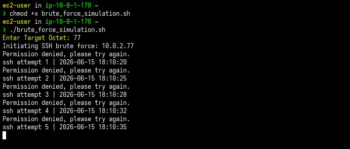
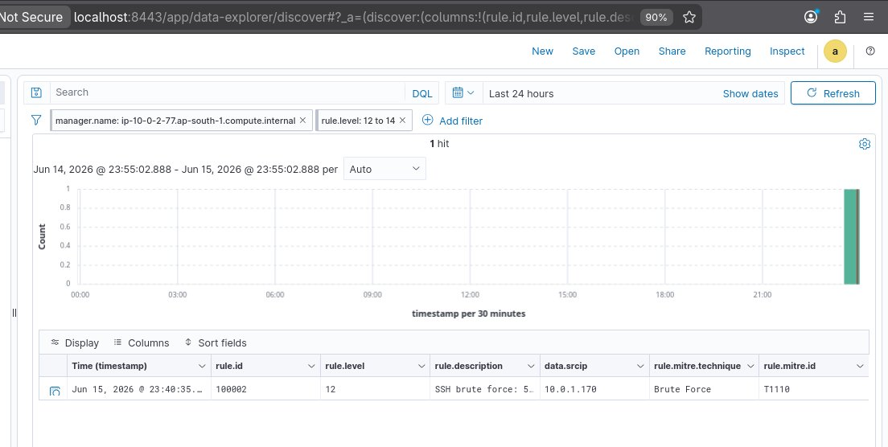
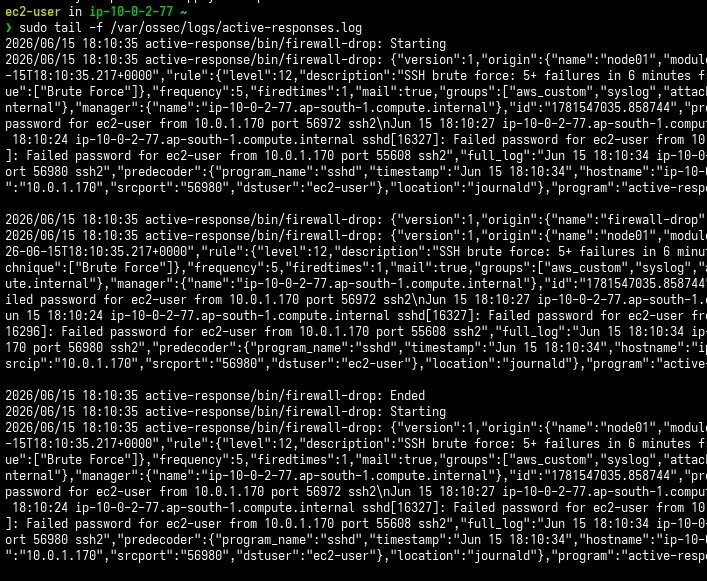
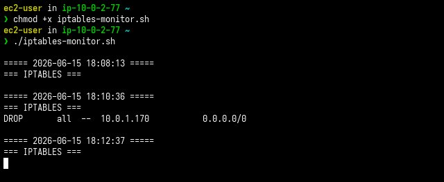
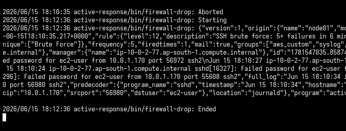
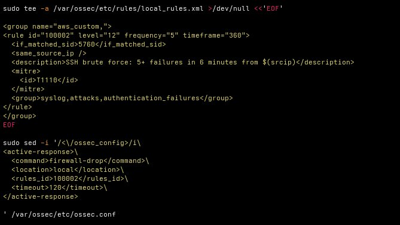
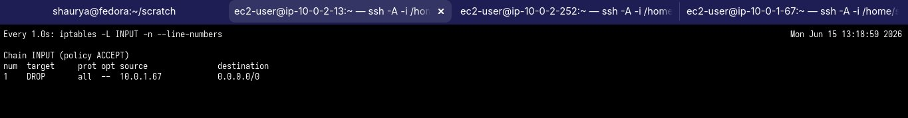

# Automated SSH Brute-Force Detection and Containment on AWS with Wazuh

**Stack:** Wazuh 4.14 · Amazon Linux 2 · AWS VPC · iptables  
**MITRE ATT&CK:** [T1110 — Brute Force](https://attack.mitre.org/techniques/T1110/) · Credential Access  
**Date:** June 2026

---

## Outcome

| Stage | Result |
|---|---|
| SSH failures generated | ✅ 6 attempts, all logged by sshd |
| Per-failure alert | ✅ Rule 5760 fires on each |
| Brute-force correlation | ✅ Rule 100002 fires at threshold |
| MITRE ATT&CK mapping | ✅ T1110 tagged on alert |
| Active response triggered | ✅ `firewall-drop` invoked automatically |
| Attacker IP blocked | ✅ iptables DROP inserted for source IP |
| Auto-recovery | ✅ DROP removed after 120 seconds |
| Dashboard visibility | ✅ Alert queryable in Wazuh Discover |

---

## Skills Demonstrated

- AWS Networking (VPC, Public/Private Subnets, NAT)
- Linux Administration
- Wazuh Detection Engineering
- Custom Correlation Rules
- MITRE ATT&CK Mapping
- Active Response Automation
- Incident Containment
- Troubleshooting and Root Cause Analysis

---

## Overview

This project deploys Wazuh on AWS and demonstrates automated threat containment: the moment an SSH brute-force attack crosses a detection threshold, Wazuh fires an active response that blocks the attacker at the network layer — no manual intervention required. The block is temporary and auto-removed after a configurable timeout.

---

## Architecture

```
                        Internet
                            │
                    ┌───────┴────────┐
                    │  Public Subnet  │  10.0.1.0/24
                    │  bastion-host   │  ← attacker + NAT gateway
                    └───────┬────────┘
                            │  (SSH jump / NAT)
                    ┌───────┴────────┐
                    │ Private Subnet  │  10.0.2.0/24
                    │                 │
                    │  wazuh-manager  │  ← Wazuh all-in-one
                    │                 │    Manager + Indexer
                    │                 │    + Dashboard
                    │  linux-victim   │  ← monitored host
                    └─────────────────┘

    AWS VPC  ap-south-1  10.0.0.0/16
```

---

## Detection Flow

```
sshd logs auth failure
        │
   Rule 5760 fires
   (per-failure, built-in)
        │
   Same source IP?
   5+ events in 360s?
        │
   Rule 100002 fires
   Level 12 · T1110
        │
   firewall-drop executes
        │
   iptables DROP inserted
   for attacker IP
        │
   120 second timeout
        │
   DROP rule removed
   (auto-recovery)
```

---

## Detection Logic

### Custom Correlation Rule

```xml
<group name="aws_custom,">
  <rule id="100002" level="12" frequency="5" timeframe="360">
    <if_matched_sid>5760</if_matched_sid>
    <same_source_ip />
    <description>SSH brute force: 5+ failures in 6 minutes from $(srcip)</description>
    <mitre>
      <id>T1110</id>
    </mitre>
    <group>syslog,attacks,authentication_failures</group>
  </rule>
</group>
```

Correlates against Wazuh's built-in rule `5760` (sshd authentication failure). Fires when the same source IP hits the threshold within the window. Level 12 activates the active response command.

### Active Response Config

```xml
<active-response>
  <command>firewall-drop</command>
  <location>local</location>
  <rules_id>100002</rules_id>
  <timeout>120</timeout>
</active-response>
```

`firewall-drop` is a Wazuh built-in that inserts an iptables DROP rule for the source IP. Automatically removed after 120 seconds.

---

## Detection Performance

| Parameter | Value |
|---|---|
| Detection threshold | 5 failed logins from same source IP |
| Correlation window | 360 seconds |
| Response execution | < 1 second after threshold crossed |
| Containment duration | 120 seconds |
| Auto-recovery | Yes — DROP rule removed at timeout |

---

## Evidence

### 1. Attack Simulation

Six sequential SSH failures from `bastion-host` targeting `wazuh-manager`. Each attempt uses a wrong password; sshd logs the failure.



---

### 2. Wazuh Dashboard — Alert Confirmed

Wazuh Discover filtered to `rule.level: 12 to 14`. Single alert: rule.id `100002`, level `12`, srcip `10.0.1.170`, technique `Brute Force`, ATT&CK ID `T1110`.



---

### 3. Active Response Triggered

`/var/ossec/logs/active-responses.log` at the moment rule 100002 fires. Shows `firewall-drop: Starting`, the embedded alert JSON (rule 100002, level 12, T1110), and the prior SSH failure events that built up to the threshold.



---

### 4. iptables Block Inserted and Auto-Removed

`iptables-monitor.sh` running in parallel on the manager. Three timestamped snapshots:

- `18:08:13` — INPUT chain empty, no attack yet
- `18:10:36` — `DROP all -- 10.0.1.170 0.0.0.0/0` inserted after threshold crossed
- `18:12:37` — chain empty again, 120-second timeout expired, auto-recovered



---

### 5. Active Response Lifecycle

Full sequence in `active-responses.log`: one `Aborted` (Wazuh deduplication rejected a concurrent duplicate invocation), followed by a clean `Starting` → alert processing → `Ended`. Confirms temporary block, not permanent.



---

### 6. Rule and Active Response Config Written to Disk

The exact commands used to write the custom rule and active response block into the Wazuh config during bootstrap.



---

### 7. iptables DROP Confirmed (Earlier Test Run)

`watch -n1 iptables -L INPUT -n --line-numbers` on the manager during a prior test. Shows `DROP all -- 10.0.1.67 0.0.0.0/0` inserted in real time.



---

## Challenges

**PasswordAuthentication disabled by default**  
Amazon Linux 2 disables password auth in sshd out of the box. The attack script reached the network layer but sshd rejected connections before any password was exchanged — so no `Failed password` entries appeared in logs. Fixed by enabling `PasswordAuthentication yes` in `sshd_config`.

**Active response aborting on concurrent invocations**  
Parallel SSH attempts fired simultaneously triggered multiple threshold crossings for the same IP at nearly the same timestamp. Wazuh's `check_keys` deduplication aborted the second invocation to avoid double-blocking. Fix: sequential attempts with `sleep 1` between each, producing one clean threshold crossing and one active response invocation.

**iptables-services failing to start**  
The default `/etc/sysconfig/iptables` shipped with `iptables-services` on AL2 uses `-m state`, which is not available on the AL2 kernel — only `conntrack` is. Fix: flush the ruleset, save (overwrites the broken default file with a clean empty ruleset), then start the service.

**firewalld conflict**  
Enabling `iptables.service` automatically stops `firewalld`. They cannot run simultaneously. Since `firewall-drop` manipulates iptables directly, firewalld being absent is required. Expected behavior, not a misconfiguration.

---

## Lessons Learned

- Active response failures often originate earlier in the pipeline than expected.
- Validate log generation before debugging correlation rules.
- Validate correlation rules before debugging containment actions.
- Sequential attack simulation produces more reliable rule correlation than parallel bursts.

---

## Reproduction

### Prerequisites

- AWS VPC with public and private subnets, NAT routing configured
- Three EC2 instances on Amazon Linux 2: `bastion-host`, `wazuh-manager`, `linux-victim`
- Security groups: SSH between hosts, Wazuh ports (1514, 1515, 443, 9200, 55000) within the private subnet

### Steps

```bash
# On wazuh-manager — run the full bootstrap
bash scripts/manager-bootstrap.sh

# On wazuh-manager — watch for the block (separate terminal)
bash scripts/iptables-monitor.sh

# On bastion-host — run the attack
bash scripts/brute-force-sim.sh
# Enter target octet when prompted (e.g. 77 for 10.0.2.77)

# Verify in Wazuh Dashboard
# https://localhost:8443 → Discover → filter rule.level: 12 to 14
```

Full cycle from clean instances to confirmed block takes under 15 minutes.

---

## Repository Structure

```
ssh-bruteforce-autoblock/
├── README.md
├── rules/
│   └── local_rules.xml              # custom Wazuh correlation rule (rule 100002)
├── scripts/
│   ├── manager-bootstrap.sh         # Wazuh install + rule + AR + iptables + sshd setup
│   ├── brute-force-sim.sh           # SSH brute-force simulation (run from bastion-host)
│   └── iptables-monitor.sh          # real-time iptables change watcher
├── docs/
│   └── debugging-notes.md           # issues encountered, root causes, fixes
└── evidence/
    ├── 01-attack-simulation.png
    ├── 02-wazuh-dashboard-alert.png
    ├── 03-active-response-trigger.png
    ├── 04-iptables-block-and-removal.png
    ├── 05-active-response-lifecycle.png
    ├── 06-rule-and-ar-config.png
    └── 07-iptables-drop-confirmed.png
```
